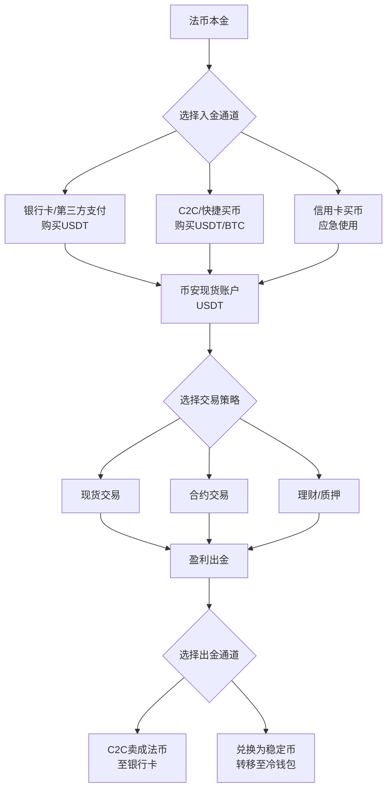

---author: "Michael Henderson"
date: 2026-04-11
linktitle: "拒绝给平台打工！币安出入金2026年保姆级教程，实测永久减免真金白银「BN52088」"
menu:
  main:
    parent: tutorials
next: /posts/ba
prev: /posts/okjy
title: "拒绝给平台打工！币安出入金2026年保姆级教程，实测永久减免真金白银「BN52088」"
weight: 1
tags: ["加密货币", "Web3", "币安"]
---
# 拒绝给平台打工！币安出入金2026年保姆级教程，实测永久减免真金白银「BN52088」

你还在为每次交易支付高昂的手续费而心疼吗？根据我的实测数据，一个年交易额10万USDT的活跃用户，如果忽略出入金策略和返佣福利，每年白白“上缴”给平台的手续费可能超过2000 USDT。这相当于你辛苦盯盘、分析行情，最终却是在为交易所打工。今天这篇教程，就是要帮你把这笔“打工钱”彻底省下来，甚至转化为你的被动收入。核心秘诀，就在于从注册那一刻起就锁定最高级别的费率减免，并使用最优的出入金路径。记住这个关键动作：填写邀请码：BN52088，它将是你摆脱“手续费奴隶”身份的第一步。

---

## 一、 为什么说“出入金”是加密投资的第一道生死线？

在谈论百倍币、千倍币之前，99%的新手都倒在了第一步：资金如何安全、低成本地进入和退出市场。高损耗的出入金方式，会在你还没开始交易前，就侵蚀掉你本金的5%-10%。2026年的今天，随着全球监管收紧，合规通道成本上升，掌握一套高效的出入金方法论，比找到一个潜力币更为迫切。

**核心风险提示（一）：** 切勿使用来路不明的第三方承兑商或个人进行OTC交易，这是资金丢失和账户被封禁的最高风险区。一切操作务必在币安官方认证的渠道内完成。

---

## 二、 2026年币安出入金全景图与核心逻辑

出入金绝非简单的“买币卖币”，它是一套包含**法币通道选择、币种选择、时机选择、安全风控**的复合策略。下图为你梳理了2026年最主流的路径：

**投资逻辑解读：**
1.  **入金优选稳定币（USDT/USDC）**：避免直接用法币购买波动大的BTC/ETH作为入金媒介，防止币价下跌导致本金缩水。稳定币是进入加密世界的“码头”。
2.  **通道成本实时对比**：币安APP内的“快捷买币”和“C2C市场”汇率、手续费随时在变，下单前必须比价。
3.  **出金规划前置**：在入金前就想好未来通过哪个渠道、以何种币种出金，避免临时找不到合适卖家或面临高溢价。

👉 [点击立即注册 Binance | 锁定 20% 终身返佣（填写邀请码：BN52088）](https://binance.com/join?ref=BN52088) | 📱 [安卓极速版下载](https://download.maxweb.click/pack/BNApp_F0001001.apk)

---

### 三、 2026 币圈全家桶：全网顶级福利矩阵
为了方便大家一次性配齐各大平台的最高优惠，建议收藏下方链接：

**1. 币安 Binance**
   * **官方注册链接：** [点击直达（省 20% 手续费）](https://binance.com/join?ref=BN52088)
   * **专属邀请码：** BN52088
   * **安卓 App 下载：** [官方极速下载通道](https://download.maxweb.click/pack/BNApp_F0001001.apk)

**2. OKX 欧易**
   * **官方注册链接：** [点击直达（最高省 30%）](https://okx.com/join/UP8888)
   * **专属邀请码：** UP8888
   * **安卓 App 下载：** [官方极速下载通道](https://download.fpnodexq.com/upgradeapp/android_G4567.apk)

**3. Bitget**
   * **官方注册链接：** [点击直达（最高省 30%）](https://partner.hdmune.cn/bg/rkx3qhn2)
   * **专属邀请码：** BG56789

**4. GMGN (冲土狗必备链上平台)**
   * **官方注册链接：** [点击直达（解锁专业看板）](https://gmgn.ai/?ref=SC789)
   * **专属邀请码：** SC789

---

## 四、 保姆级实操：币安最低成本入金四步法（2026实测）

**核心风险提示（二）：** 所有操作前，请确保已通过币安全功能KYC认证，并使用已绑定本人实名信息的支付方式。任何信息不匹配都可能导致资金冻结。

1.  **第一步：激活你的费率减免特权**
    *   如果你是新用户，请务必通过上方专属链接注册，并在“推荐人ID”栏确认已自动填入 BN52088。这是享受20%手续费返佣的**唯一且不可补填**的机会。
    *   老用户请检查你的费率等级。通过持有BNB、完成身份认证、增加交易量等方式，可以进一步提升费率等级。

2.  **第二步：法币通道比价与选择（以购买1000 USDT为例）**
    *   **打开币安App**，点击首页【买币】->【快捷买币】。
    *   输入金额“1000”，选择“USDT”，系统会列出所有可用支付方式（银行卡、支付宝、微信支付等）的实时报价。
    *   **同时，点击【C2C交易】**，查看商家挂单价格。通常C2C市场的汇率会更优，但需要选择信誉高、交易量大的认证商家。
    *   **决策点**：对比“快捷买币”的总价（含手续费）和“C2C”中信誉最好商家的报价，选择总成本最低的通道。价差可能达到0.5%-1%。

3.  **第三步：执行购买与安全确认**
    *   若选择C2C，下单后，**务必在币安App内收到的聊天窗口与卖家沟通**，切勿切换到微信、Telegram等外部工具。
    *   按照卖家提供的收款信息进行付款，付款金额必须与订单完全一致，**切勿备注任何与加密货币相关的信息（如BTC、USDT等）**。
    *   付款完成后，点击“我已付款”并耐心等待卖家放币。资金会自动进入你的币安现货钱包。

4.  **第四步：入金后关键操作——并非立即交易**
    *   收到USDT后，不要急于冲进市场。建议先转入【币安理财】的“活期宝”或“期限灵活”产品，赚取第一笔微小但重要的利息（约3%-5%年化）。
    *   这既是资金管理，也为你冷静观察市场、制定交易计划留出时间。

👉 [点击立即注册 Binance | 锁定 20% 终身返佣（填写邀请码：BN52088）](https://binance.com/join?ref=BN52088) | 📱 [安卓极速版下载](https://download.maxweb.click/pack/BNApp_F0001001.apk)

---

## 五、 安全出金与资金撤离全指南

出金的最高原则是：**安全、合规、可追溯**。

1.  **出金路径选择**
    *   **C2C卖币**：最常用的法币出金渠道。在C2C市场发布出售USDT的广告，或直接购买信誉买家的广告。**务必选择“已完成实名认证”且“交易笔数多、好评率接近100%”的买家**。收到对方付款并确认资金到账无误后，再在App内放币。
    *   **提现至链上钱包**：如果并非需要法币，而是将资产转移至自托管钱包（如Ledger, MetaMask）进行长期储存或参与DeFi，则使用【提现】功能。**核心风险提示（三）：提现时，区块链网络手续费（Gas Fee）是浮动且不可退的，务必确认好主网（如ERC20, BEP20）和地址100%正确，小额可先进行测试转账。**

2.  **出金时机与税务筹划**
    *   避免在市场极端恐慌或FOMO情绪高涨时集中出金，此时C2C市场可能出现大幅溢价或折价，流动性也差。
    *   了解你所在国家或地区关于加密货币收益的税务政策。保留好所有出入金记录、交易记录，以备报税之需。

---

## 六、 2026年高阶策略：如何让出入金本身产生收益？

对于资金量较大的用户，出入金可以不再是成本中心，而成为收益来源：

*   **套利C2C价差**：密切关注不同支付方式、不同商家之间的买一卖一价差。在价差足够覆盖风险和时间成本时，可以进行低买高卖的套利操作。
*   **利用闪兑与跨链桥**：当某条链（如Polygon）上的USDT价格因供需出现轻微溢价时，可以从其他链低价买入，通过币安跨链兑换功能转入并卖出，赚取差价。
*   **参与平台活动**：币安时常推出“使用XX通道买币，瓜分10,000 USDT奖励”等活动。在满足自身入金需求的同时参与活动，可进一步摊薄成本。

---

## 总结：从“打工者”到“平台合伙人”的思维转变

通过这篇教程，你应该深刻认识到，在加密世界，每一个操作细节都关联着真金白银。使用 BN52088 注册，不仅仅是获得20%的手续费减免，更是确立了一种“成本优先、效率至上”的专业投资者思维。出入金是交易的起点与终点，将这个环节优化到极致，你节省下的每一分钱，都是你未来利润的坚实基础。拒绝无谓的损耗，从选择正确的开始方式做起。