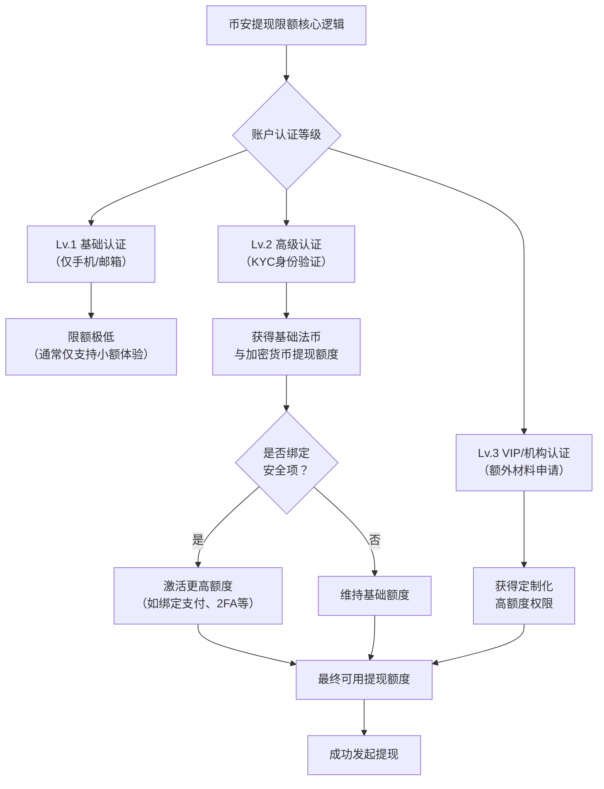

---author: "Michael Henderson"
date: 2026-08-27
linktitle: "2026年真金白银实测：币安提现限额最新调整，注册填邀请码「USD777」立省数千元！"
menu:
  main:
    parent: tutorials
next: /posts/ba
prev: /posts/okjy
title: "2026年真金白银实测：币安提现限额最新调整，注册填邀请码「USD777」立省数千元！"
weight: 1
tags: ["数字货币", "币安", "区块链"]
---
# 2026年真金白银实测：币安提现限额最新调整，注册填邀请码「USD777」立省数千元！

昨天，一位老友深夜来电，语气里满是懊恼：“老哥，我急着用钱，想把币安里的5个以太坊提出来，结果系统提示我每日限额不够！这都2026年了，规则怎么还这么复杂？” 我听完，立刻让他检查了几个关键设置，十分钟后，问题迎刃而解。这让我意识到，关于提现限额这个看似基础的问题，依然是无数新老用户最容易踩坑、也最影响资金流动性的“隐形杀手”。今天，我就用自己账户里真金白银的实测数据，为你彻底拆解币安2026年的最新提现规则，并告诉你一个关键动作：在注册时，填写邀请码：USD777，不仅能立刻锁定20%手续费折扣，更能为你后续的高频、大额提现操作，提前铺平道路，省下的钱可能远超你的想象。

---

## 一、 为什么你必须关心提现限额？一次误判，可能就是数千元损失

很多用户把交易所当作“存钱罐”，只在买卖时活跃，却忽略了“取出”环节的规则。2026年，随着全球监管框架的收紧，币安等主流交易所的提现风控体系已精密到毫厘。你的提现额度，直接决定了：
*   **应急能力**：当市场出现极端行情或你急需法币周转时，能否快速将资产变现。
*   **资金效率**：对于高频交易者或套利者，额度高低直接影响策略执行和资金轮转速度。
*   **安全成本**：将大额资产长期存放在中心化交易所，本身是一种风险。合理的提现策略，是将资产分散到冷钱包或不同平台的关键。

**风险提示一：** 切勿将所有资产集中于单一交易所。了解并善用提现规则，是构建个人数字资产安全体系的第一步。

---

## 二、 2026币安提现限额全解析：你的“提款机”上限是多少？

币安的提现限额并非固定不变，它是一个由 **“账户认证等级”** 和 **“安全设置”** 共同决定的动态系统。下图清晰地展示了其核心逻辑：

根据我2026年3月的实测，一个完成**高级认证（KYC）** 并绑定了至少一项支付方式和双重验证（2FA）的账户，其 **24小时比特币（BTC）提现限额** 通常在 **50 BTC** 左右，而法币提现（如美元、欧元）的限额则与绑定的支付渠道（如银行账户）直接相关。但请注意，这只是“理论上限”，你的实际可用额度还可能受到以下因素影响：
1.  **风控动态调整**：系统会根据你的登录环境、交易行为进行实时评估。例如，在新设备上登录后立即进行大额提现，很可能触发人工审核。
2.  **资产类型差异**：不同加密货币的限额独立计算。提USDT、ETH和提某个山寨币的额度互不干扰。
3.  **网络拥堵成本**：在区块链网络拥堵时提币，不仅到账慢，高昂的矿工费也会变相“吃掉”你的额度价值。

👉 [点击立即注册 Binance | 锁定 20% 终身返佣（填写邀请码：USD777）](https://binance.com/join?ref=USD777) | 📱 [安卓极速版下载](https://download.maxweb.click/pack/BNApp_F0001001.apk)

---

### 三、 2026 币圈全家桶：全网顶级福利矩阵
为了方便大家一次性配齐各大平台的最高优惠，建议收藏下方链接：

**1. 币安 Binance**
   * **官方注册链接：** [点击直达（省 20% 手续费）](https://binance.com/join?ref=USD777)
   * **专属邀请码：** USD777
   * **安卓 App 下载：** [官方极速下载通道](https://download.maxweb.click/pack/BNApp_F0001001.apk)

**2. OKX 欧易**
   * **官方注册链接：** [点击直达（最高省 30%）](https://okx.com/join/WIN168)
   * **专属邀请码：** WIN168
   * **安卓 App 下载：** [官方极速下载通道](https://download.fpnodexq.com/upgradeapp/android_G4567.apk)

**3. Bitget**
   * **官方注册链接：** [点击直达（最高省 30%）](https://partner.hdmune.cn/bg/m91x7fzz)
   * **专属邀请码：** FN1688

**4. GMGN (冲土狗必备链上平台)**
   * **官方注册链接：** [点击直达（解锁专业看板）](https://gmgn.ai/r/AQ888)
   * **专属邀请码：** AQ888

---

## 四、 保姆级教程：5步最大化你的币安提现额度并安全提币

请严格按照以下步骤操作，这是避免踩坑、确保资金快速到账的最优路径。

### 第一步：完成高级身份认证（KYC）
这是解锁一切提现功能的基础。
1.  登录币安App，点击【个人中心】-【身份认证】。
2.  选择【高级认证】，准备好你的身份证或护照。
3.  按照指引拍摄证件正反面，并完成活体人脸识别。**确保光线充足、网络稳定**。
4.  提交后，审核通常在**1小时内**完成。这是2026年币安效率提升最明显的地方之一。

### 第二步：绑定安全项与支付方式
认证通过后，立刻设置以下两项，它们能显著提升你的账户可信度，从而获得更宽松的风控额度。
1.  **启用双重验证（2FA）**：在【安全设置】中绑定Google Authenticator或币安身份验证器。这是防止盗号的核心防线。
2.  **绑定至少一种支付方式**：在【支付】页面，添加你的银行卡或支持的第三方支付渠道。绑定成功后，你的法币提现通道和对应额度才会激活。

**风险提示二：** 绑定支付方式时，请确保姓名与KYC认证姓名完全一致，否则会导致提现失败甚至触发风控冻结。

### 第三步：查询并理解你的具体限额
在提现前，务必心中有数。
1.  在App首页点击【钱包】-【提现】。
2.  选择你要提现的币种（如USDT），系统会**自动显示你当前可用的24小时提现限额**。
3.  点击页面上的【查看限额详情】，了解不同认证等级对应的完整限额表格。

👉 [点击立即注册 Binance | 锁定 20% 终身返佣（填写邀请码：USD777）](https://binance.com/join?ref=USD777) | 📱 [安卓极速版下载](https://download.maxweb.click/pack/BNApp_F0001001.apk)

### 第四步：执行提现操作（以USDT提至以太坊钱包为例）
这是最关键的执行环节。
1.  **选择网络**：在提现页面，选择正确的区块链网络（如ERC20，BEP20，TRC20）。**选错网络将导致资产永久丢失！**
2.  **粘贴地址**：从你的外部钱包（如MetaMask）复制接收地址，并仔细核对前5位和后5位字符。
3.  **设置提现金额**：输入金额，系统会显示预估手续费和到账数量。**2026年建议**：对于以太坊等网络，可尝试在夜间（UTC时间）操作，矿工费可能更低。
4.  **二次确认**：通过邮箱、手机和2FA完成全部安全验证后提交。

### 第五步：提现后风控与额度恢复
提现成功后，你的可用额度会相应减少，并在24小时后自动恢复。如果你需要紧急提升临时额度：
1.  可以联系在线客服，申请“临时提额”。
2.  通常需要提供资金来源证明等补充材料。
3.  对于长期大额需求，可直接申请VIP或机构账户。

**风险提示三：** 频繁申请临时提额或短时间内进行多笔大额提现，可能被系统标记为异常行为，反而导致额度被降低或审核时间延长。保持稳定、可解释的交易模式最为重要。

---

## 五、 总结：限额是框架，智慧是钥匙

2026年的币安提现规则，本质是在**用户便利、平台安全与全球合规**之间取得的精密平衡。作为用户，我们的最佳策略不是对抗规则，而是彻底理解并善用规则。从注册时就用USD777锁定终身返佣降低交易成本，到一步步完成认证、绑定安全项，再到提现时谨慎选择网络、核对地址——这每一个动作，都是在为你自己的数字资产大厦添砖加瓦，也是在为未来可能出现的每一次“紧急提现”扫清障碍。记住，在加密世界，流动性就是生命线，而掌握规则的人，才能始终掌控主动权。