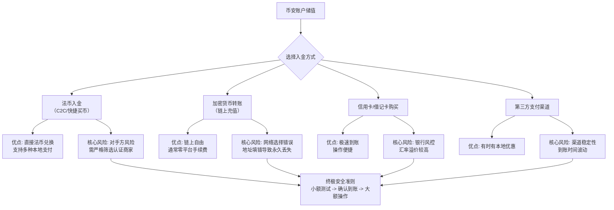

---author: "Michael Henderson"
date: 2026-10-09
linktitle: "2026年实测避坑指南：币安储值方式最新教程，用邀请码【QY999】享永久手续费减免！"
menu:
  main:
    parent: tutorials
next: /posts/ba
prev: /posts/okjy
title: "2026年实测避坑指南：币安储值方式最新教程，用邀请码【QY999】享永久手续费减免！"
weight: 1
tags: ["赚钱技巧", "币安", "区块链"]
---
# 2026年实测避坑指南：币安储值方式最新教程，用邀请码【QY999】享永久手续费减免！

你知道吗？在币圈，你的第一笔交易成本可能在注册那一刻就已经注定了。很多新手兴冲冲地冲进市场，却忽略了最基础的“入场券”设置，导致后续每一笔交易都白白多付了20%的手续费。这就像还没开跑，就先给自己绑上了沙袋。今天，我们不谈复杂的K线，就聊一个最实在的问题：如何用最聪明、最安全的方式，给你的币安账户“喂”进第一笔资金。记住，正确的开始是成功的一半，而这一切的起点，就是在注册时填写邀请码：QY999，锁定那份永久的费率优势。

---

## 一、 为什么储值是交易的第一道生死关？

在深入教程之前，我们必须建立正确的认知：**储值（入金）是连接现实世界与加密世界的唯一桥梁，也是资金安全面临的第一道考验。** 2026年的市场环境更加复杂，监管收紧、骗术升级，一个错误的储值操作，轻则导致资金延迟、成本飙升，重则资产尽失。本文将基于我8年的实战经验，为你拆解币安所有主流储值方式的优劣、隐藏成本和避坑要点，确保你的每一分钱都能安全、高效地抵达战场。

---

## 二、 2026年币安储值全景图：四种核心路径深度解析

币安的储值方式主要分为四大类：**法币入金、加密货币转账、信用卡购买、第三方支付**。每种方式都有其特定的使用场景、时间成本和资金成本。下图为你清晰梳理了2026年的选择逻辑：

理解了这个决策框架，我们就能针对性地深入每一种方式。但在开始任何操作前，请确保你拥有一个享有最高费率折扣的账户。👉 [点击立即注册 Binance | 锁定 20% 终身返佣（填写邀请码：QY999）](https://binance.com/join?ref=QY999) | 📱 [安卓极速版下载](https://download.maxweb.click/pack/BNApp_F0001001.apk)

---

### 三、 2026 币圈全家桶：全网顶级福利矩阵
为了方便大家一次性配齐各大平台的最高优惠，建议收藏下方链接：

**1. 币安 Binance**
   * **官方注册链接：** [点击直达（省 20% 手续费）](https://binance.com/join?ref=QY999)
   * **专属邀请码：** QY999
   * **安卓 App 下载：** [官方极速下载通道](https://download.maxweb.click/pack/BNApp_F0001001.apk)

**2. OKX 欧易**
   * **官方注册链接：** [点击直达（最高省 30%）](https://okx.com/join/WIN168)
   * **专属邀请码：** WIN168
   * **安卓 App 下载：** [官方极速下载通道](https://download.fpnodexq.com/upgradeapp/android_G4567.apk)

**3. Bitget**
   * **官方注册链接：** [点击直达（最高省 30%）](https://partner.hdmune.cn/bg/m91x7fzz)
   * **专属邀请码：** FN1688

**4. GMGN (冲土狗必备链上平台)**
   * **官方注册链接：** [点击直达（解锁专业看板）](https://gmgn.ai/r/AQ888)
   * **专属邀请码：** AQ888

---

## 四、 保姆级避坑实操教程（2026最新版）

### 1. 路径一：法币入金（C2C/快捷买币）—— 最适合新手的起点
这是用人民币、新台币等本地货币直接购买USDT、BTC等资产的核心方式。

**操作步骤：**
1.  **登录并进入买币页面**：在币安App首页点击“买币”，或网页端“一键买币”。
2.  **选择商家与支付方式**：
    * **避坑重点1：** 务必选择“完成率”高（>98%）、“交易笔数”多（>1万笔）且带有“蓝盾”或“金牌”标识的认证商家。这是规避“黑钱”和冻卡风险的第一道防火墙。
    * **避坑重点2：** 仔细阅读商家广告的“备注”和“限额”。部分商家只支持特定银行的转账，或要求实名一致。
3.  **下单与付款**：
    * 输入你想购买的法币金额，系统会自动计算可得加密货币数量。
    * 下单后，**严格按照平台显示的收款账户信息（姓名、银行卡号）进行转账**。**绝对不要**通过商家提供的任何第三方链接或二维码付款。
    * 付款后，点击“已付款，请放币”。此时资金由币安平台托管，卖家确认收款后，资产会自动进入你的币安现货钱包。
4.  **到账确认**：通常在5-15分钟内完成。如果超时，可点击“申诉”由平台客服介入。

> **风险提示**：法币交易区是洗钱高发地。务必保留好转账凭证（截图），并确保资金来源合法合规。避免在深夜或凌晨进行大额交易，此时客服响应较慢。

### 2. 路径二：加密货币转账（链上充值）—— 老玩家的主要通道
如果你在其他钱包或交易所已有加密货币，可通过此方式转入币安。

**操作步骤：**
1.  **获取币安充值地址**：在币安App点击“钱包”->“现货”->“充值”，搜索你要转入的币种（如BTC、ETH、USDT）。
2.  **选择充值网络（2026年最核心的避坑点！）**：
    * 系统会显示该币种支持的多个网络（如USDT支持TRC20, ERC20, BEP20等）。
    * **避坑核心：** **必须确保你提币的平台/钱包选择的网络，与币安充值页面选择的网络完全一致！** 例如，从交易所提USDT到币安，如果币安这里选的是**TRC20**网络，那么提币平台也必须选择**TRC20**网络。选错网络会导致资产永久丢失，且无法追回！
    * **网络选择建议**：
        * **USDT小额高频：** 选**TRC20**，零手续费，到账快。
        * **USDT大额或追求最高安全性：** 选**ERC20**（以太坊网络），但手续费较高。
        * **在币安生态内转账：** 选**BEP20**（BSC网络），手续费低，速度较快。
3.  **复制地址并提币**：复制币安提供的专属充值地址（或扫码），到你的提币平台粘贴该地址，并**二次核对网络是否正确**，然后发起提币。
4.  **等待区块链确认**：到账时间取决于网络拥堵情况，通常TRC20在1分钟内，ERC20可能需要10-30分钟。你可以在“充值历史”中查看进度。

> **风险提示**：**网络选择错误是资产丢失的首要原因，没有之一！** 每次操作前，请执行“地址前3位和后3位”核对仪式。对于不熟悉的币种，务必先进行极小金额（如1美元）的测试充值，确认到账后再进行大额操作。

### 3. 路径三：信用卡/借记卡购买 —— 极速但成本高
适合急需入金、能够接受较高溢价的用户。

**操作步骤：**
1.  在“买币”页面选择“信用卡/借记卡”选项。
2.  输入购买金额，系统会显示预估得到的加密货币数量及包含的汇率溢价和服务费（通常为3%-5%）。
3.  填写卡片信息并完成3D安全验证。
4.  资产几乎实时到账。

> **风险提示**：部分银行可能将此类交易标记为高风险，导致交易失败或卡片被暂时冻结。交易前可咨询发卡行。此外，这是成本最高的入金方式，不适合作为常规储值手段。

### 4. 路径四：第三方支付渠道 —— 关注本地化优惠
币安会接合一些地区的本地支付服务商（如某些地区的电子钱包）。

**操作步骤**：在“买币”页面查看是否有你所在地区支持的特定支付渠道，按指引操作即可。
**避坑重点**：关注渠道的每日限额、到账时间（可能非即时）以及是否收取额外费用。

👉 无论你选择哪种方式，一个享有手续费折扣的账户都能在你后续交易中持续省钱。还没账户？[点击立即注册 Binance | 锁定 20% 终身返佣（填写邀请码：QY999）](https://binance.com/join?ref=QY999) | 📱 [安卓极速版下载](https://download.maxweb.click/pack/BNApp_F0001001.apk)

---

## 五、 2026年储值安全终极清单

1.  **环境安全**：始终在官方App或官网操作，警惕钓鱼网站。检查网址是否为 `binance.com`。
2.  **信息隔离**：用于接收验证码和邮件的设备，尽量与日常上网设备分离。
3.  **小额测试**：对于任何新路径、新地址，坚持“测试先行”原则。
4.  **私钥/助记词永不触网**：币安是中心化交易所，你无需在此备份私钥。任何索要私钥和助记词的都是骗子。
5.  **启用所有安全设置**：注册后立即绑定2FA（谷歌验证器）、设置防钓鱼码、管理API密钥。

---

## 六、 总结与建议

储值绝非简单的“转账”，它是一门融合了成本计算、风险控制和时机选择的实战学问。对于2026年的投资者，我的建议是：
*   **新手**：从**法币入金（C2C）** 开始，严格筛选商家，完成小额初体验。
*   **进阶用户**：将**加密货币链上转账**作为主力，精通不同网络的特点，永不错选网络。
*   **所有用户**：将邀请码：QY999带来的20%手续费减免，视为你的基础装备。在漫长的交易生涯中，这节省下来的每一分钱，都会转化为你账户里实实在在的利润。

工欲善其事，必先利其器。掌握安全、低成本的储值方式，就是打磨你征战加密世界的第一把，也是最关键的一把利器。现在，就去行动吧。